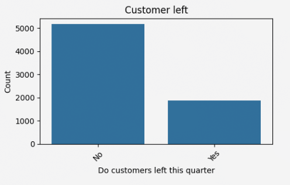

# Customer Churn Prediction — Telco

Predicting customer churn for a telecom company using machine learning, with cost-sensitive analysis to optimize retention strategy.

<!-- Add screenshot: Streamlit app demo -->

---

## Project Structure

```
customer-churn-prediction-telco-/
├── src/churn/
│   ├── __init__.py
│   ├── data.py            # Data loading & preprocessing (category/bool coercion)
│   ├── models.py          # sklearn Pipelines (ColumnTransformer + estimator step)
│   ├── tuning.py          # Optuna tuning + nested-CV OOF (Model.ipynb port)
│   ├── cost.py            # Cost model (FN $997.94 / FP $89.33) & cost curves
│   └── report.py          # COST_DATA builder, JSON output, HTML patching
├── scripts/
│   ├── generate_chart_data.py   # Regenerates dashboard COST_DATA (full-dataset OOF basis)
│   ├── generated_cost_data.json # Latest embedded data
│   └── oof_proba.npz           # Out-of-fold probabilities (rf/lgb)
├── notebooks/
│   ├── EDA.ipynb          # Exploratory data analysis & feature insights
│   ├── Baseline.ipynb     # Model baselines & imbalance handling experiments
│   └── Model.ipynb        # Tuned LightGBM with Optuna, SHAP interpretation & cost analysis
├── data/
│   └── dataset.csv        # Telco customer churn dataset
├── assets/
│   └── Churn distribution.png
├── .streamlit/
│   └── config.toml        # Streamlit custom theme config
├── telco_churn_dashboard.html  # Interactive HTML dashboard
├── AGENTS.md              # Agent instructions for AI coding assistants
├── pyproject.toml         # Python project config (uv, hatchling, streamlit)
├── README.md
└── .gitignore
```

---

## Dataset

**Source:** [Telco Customer Churn — Kaggle](https://www.kaggle.com/datasets/blastchar/telco-customer-churn)

[full dataset description](https://community.ibm.com/community/user/blogs/steven-macko/2019/07/11/telco-customer-churn-1113)

| Stat | Value |
|------|-------|
| Rows | 7,043 (7,032 after cleaning) |
| Features | 21 |
| Churn rate | ~27% (class imbalance) |

The dataset includes customer demographics, account information, services subscribed, and whether the customer churned in the last quarter.

---

## Exploratory Data Analysis

Key findings from `notebooks/EDA.ipynb`:

### Churn Distribution

The dataset is imbalanced — roughly 1 in 4 customers churned.

<!-- Add screenshot: Churn distribution bar plot -->


### Feature Distributions

<!-- Add screenshot: Discrete feature distributions (17 bar plots) -->

<!-- Add screenshot: Continuous feature histograms (tenure, MonthlyCharges, TotalCharges) -->

### Correlation Analysis

Binary and numeric features show small-to-medium correlations with the target. Notable multicollinearity exists between `tenure`, `MonthlyCharges`, and `TotalCharges`.

<!-- Add screenshot: Correlation heatmap -->

### Cramer's V — Nominal Feature Importance

Strongest predictors of churn:
- **Contract type** (month-to-month = high churn risk)
- **InternetService** (fiber optic = higher churn)
- **PaymentMethod** (electronic check = higher churn)
- **OnlineSecurity / TechSupport** (absence = higher churn)

<!-- Add screenshot: Cramer's V point plots -->

> [!NOTE]
> Streaming services (TV, Movies) showed high initial correlation with churn, but this was largely explained by whether the customer had internet at all — not by the streaming itself.

### Dimensionality Reduction (FAMD)

Factor Analysis of Mixed Data shows churn/non-churn clusters overlap significantly — the two components explain only ~15% of variance.

<!-- Add screenshot: FAMD 2D scatter plot -->

### Survival Analysis

Kaplan-Meier survival curve reveals that new customers (<10 months tenure) are at highest risk of churning. Long-tenure customers are far more stable.

<!-- Add screenshot: Kaplan-Meier survival curve -->

---

## Baseline Model

**Model:** Random Forest Classifier (5-fold stratified cross-validation)

| Metric | Class: No Churn | Class: Churn |
|--------|-----------------|--------------|
| Precision | 0.83 | 0.64 |
| Recall | 0.90 | 0.48 |
| F1-score | 0.86 | 0.55 |
| **PR-AUC** | — | **0.6107 ± 0.0184** |

> [!WARNING]
> The baseline model struggles with the minority class — recall of only 48% on churners means more than half of actual churners are missed. This is driven by the ~3:1 class imbalance.

---

## Handling Class Imbalance

Several approaches were tested:

| Approach | Churn Recall | Churn Precision | PR-AUC | Notes |
|----------|:------------:|:---------------:|:------:|-------|
| RF Baseline | 0.48 | 0.64 | 0.6107 | No imbalance handling |
| RF + `class_weight="balanced"` | 0.48 | 0.64 | 0.6148 | Negligible improvement (documented limitation of tree models) |
| **LightGBM** (`scale_pos_weight`) | **0.75** | 0.53 | **0.6533** | Best PR-AUC; native imbalance parameter |
| Undersampling + RF | 0.76 | 0.51 | 0.6110 | Good recall, similar AUC to baseline |
| Bootstrap Oversampling + RF | 0.58 | 0.59 | 0.5998 | Moderate improvement |
| SMOTE + RF | 0.58 | 0.58 | 0.5913 | Limited by mostly-categorical data |
| GBDT + Undersampling | 0.77 | 0.50 | 0.6317 | Best recall, but lower AUC than standalone LightGBM |

<!-- Add screenshot: Model comparison bar chart (Precision, Recall, PR-AUC) -->

> [!TIP]
> **Best approaches:**
> - **LightGBM with `scale_pos_weight`** — best overall balance (recall + AUC)
> - **Undersampling + Random Forest** — best recall, lower compute cost

### Why SMOTE underperformed

The dataset is mostly categorical (only 3 numeric features). SMOTE interpolates between nearest neighbors, which mostly duplicates categorical values and adds noise to the numeric ones — yielding results similar to basic bootstrap oversampling.

---

## Model Development

Combining insights from `EDA.ipynb` and `Baseline.ipynb` into a production-ready model in `notebooks/Model.ipynb`.

### Feature Selection

Based on EDA findings, dropped all non-predictive columns:
- **`customerID`** — unique identifier
- **`gender`** — no correlation with churn
- **`MultipleLines`** — redundant with `PhoneService`
- **`StreamingTV` / `StreamingMovies`** — high initial correlation explained by internet service, not streaming itself

### Model Training

**Model:** LightGBM (GBDT) with `scale_pos_weight` for class imbalance — the best-performing approach from baseline experiments.

**Hyperparameter tuning:** Optuna (50 trials) optimizing two objectives independently:
- **PR-AUC** (threshold-independent ranking)
- **Recall** (threshold-dependent classification)

Both optimizations yield statistically equivalent cost outcomes, so either objective can be used.

**Validation:** Nested cross-validation (5 outer folds, 50 Optuna trials per fold) to prevent model selection bias. Hyperparameters are tuned only on each outer training fold; cost estimates come from held-out outer test folds that were never seen during tuning.

### Cost-Optimized Threshold

With retention success probability of **45%** (per Harvard Business Review):

| Metric | Value |
|--------|-------|
| FN cost (missed churner) | $997.94 |
| FP cost (false alarm) | $89.33 |
| Best threshold | Determined per fold via cost minimization |
| Model vs. no-model cost | Model achieves significant savings at 45% retention effectiveness |

> [!TIP]
> PR-AUC and Recall-based tuning produce statistically equivalent cost outcomes, so either optimization target can be used.

### Model Interpretation (SHAP)

SHAP analysis reveals the top-5 churn drivers:

1. **Contract type** — month-to-month customers are substantially more likely to churn
2. **Tenure** — new customers (low tenure) have higher churn risk; long-tenure customers are stable
3. **Monthly charges** — higher bills correlate with increased churn probability
4. **Tech support** — absence of tech support signals higher churn
5. **Total charges** — low total charges indicate newer customers (multicollinearity with tenure and monthly charges may introduce noise)

> [!NOTE]
> The churning customer profile: new subscribers on month-to-month contracts with high monthly bills and no value-added services (tech support). This aligns with business intuition and expands the EDA hypothesis to include contract type influence.

---

## Precision-Recall Analysis

<!-- Add screenshot: PR curves for essential models (2x2 grid) -->

Key takeaways from the PR curves:
- ~70% precision achievable at ~20% recall (confident but conservative)
- 80–100% recall possible at 25–40% precision (aggressive but noisy)
- **~60% recall at ~60% precision** — the practical middle ground

---

## Cost-Sensitive Analysis

Translating model performance into business dollars:

| Error Type | Cost | Meaning |
|------------|------|---------|
| **False Negative** (missed churner) | **$997.94** | Lost customer lifetime value |
| **False Positive** (false alarm) | **$89.33** | Unnecessary retention offer |

<!-- Add screenshot: Total cost vs threshold curve at different retention rates -->

### Threshold Recommendations

Based on retention company success probability:

| Retention Success Rate | Recommended Threshold | Rationale |
|------------------------|----------------------|-----------|
| **> 20%** | 0.1 – 0.3 | Aggressive: catch more churners since retention is effective |
| **< 20%** | 0.4 – 0.8 | Conservative: only intervene when confident, since retention rarely works |

> [!IMPORTANT]
> At retention success below ~20%, the ML model becomes unprofitable compared to a "no model" approach (predicting no one churns). The model's value depends on the retention team's effectiveness.

**Reference:** Harvard Business Review — "Marketing: Winning Back Lost Customers" (22 page)

---

## Interactive Dashboard

An interactive HTML dashboard (`telco_churn_dashboard.html`) is included for exploring model results, comparing approaches, and visualizing cost trade-offs without running any code. Open it in any browser. Look at deployed dashboard here: https://churn-telco-dashboard.vladsmertev24.workers.dev/

---

## Limitations

- **Historical snapshot**: The analysis relies on a single historical dataset; model performance should be validated on current data before deployment
- **Temporal dynamics**: Seasonal churn patterns and other time-dependent effects were not explicitly modeled
- **Multicollinearity**: `TotalCharges` exhibits multicollinearity with `tenure` and `MonthlyCharges`, which may introduce noise in SHAP interpretation
- **Retention dependency**: The model's profitability hinges on actual retention success probability — if retention effectiveness falls below ~20%, the model becomes unprofitable vs. a "no model" baseline

---

## Recommendations

1. **Model choice:**
   - Use **LightGBM with Optuna tuning** (PR-AUC or Recall objective) for best cost savings
   - Use **Undersampling + Random Forest** when inference speed is critical

2. **Threshold tuning:** tune decision threshold via cost minimization given your retention team's success rate — the cost-optimal threshold depends heavily on retention effectiveness

3. **Business insight:** high-risk customers are **new subscribers on month-to-month contracts with high monthly charges and no tech support** — target retention offers at this segment

4. **A/B test retention success rate:** the model's profitability hinges on actual retention probability. If retention success falls below ~20%, the model becomes unprofitable vs. a "no model" baseline

---

> [!NOTE]
> The notebooks download the dataset from Kaggle automatically via `kagglehub`. You need a Kaggle account and API credentials configured.

---

## License

This project is licensed under the MIT License.
